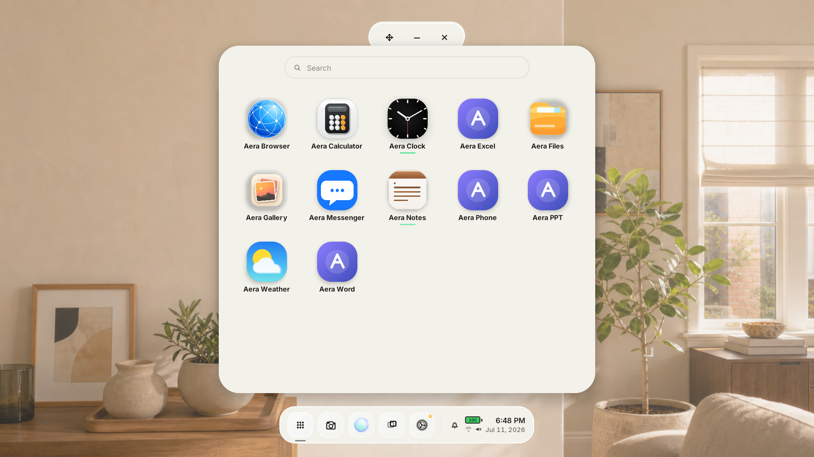
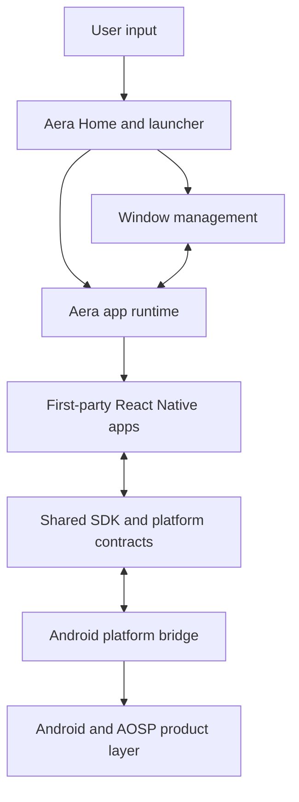
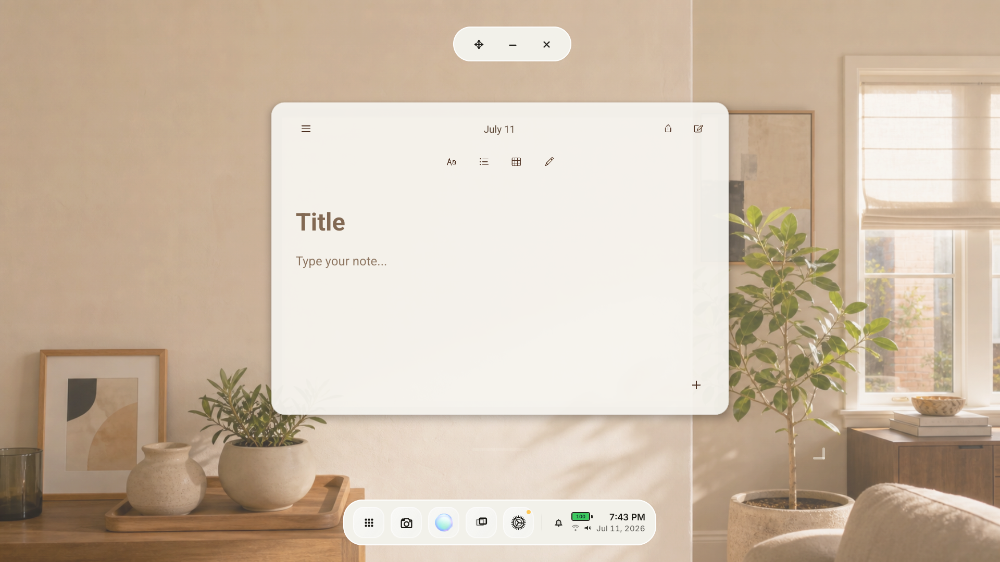

# Aera OS

### A spatial interface built on Android

**Enrico Fabri · OS architecture with AI-assisted development**

Aera OS explores how a launcher, everyday apps, and window interactions can work together in a spatial computing interface for the glasses. The implementation combines an Android Home shell, an app runtime, first-party React Native apps, and an AOSP product overlay.

*Development screenshot from July 2026. The launcher illustrates the app ecosystem; the presence of an icon does not imply that every app is complete.*

## What I work on

My role is **OS architecture with AI-assisted development**: shaping how the operating-system interface, app platform, and development workflow fit together. This case study presents the resulting architecture and product work.

## The project

| Area | Implementation |
| --- | --- |
| Home and launcher | Android shell that owns the shared system surface and launches Aera apps |
| Window interactions | Shared platform contracts for app windows and spatial panels |
| App platform | Manifest-backed apps hosted through the Aera runtime |
| First-party apps | React Native applications including Notes, Weather, and Files |
| Platform integration | Android bridge and an AOSP product overlay for the emulator image |
| Developer workflow | Package tooling, tests, and scoped deployment verification |

**Stack:** Android · Kotlin · React Native · TypeScript · AOSP · Gradle · pnpm

## Architecture at a glance

*Simplified component view. Internal interfaces and implementation details are omitted.*

## A closer look: Notes

*Development screenshot from July 2026, showing an empty note. The app surface and system window controls have distinct responsibilities.*

Notes illustrates the central design problem: familiar content and editing actions need to coexist with a consistent window model. The app provides its writing interface; the platform supplies the surrounding shell and shared interaction behavior.

## Engineering decisions

- **Separate the shell from apps.** Shared launcher and window behavior belong to the platform, while each app owns its content and workflows.
- **Use shared contracts.** A manifest-backed runtime and common SDK reduce the amount of platform behavior that apps must recreate.
- **Connect React Native to Android deliberately.** Reusable app UI sits alongside a native host and platform bridge.
- **Keep iteration scoped.** Package-specific development and verification help preserve unrelated apps and data while a feature changes.
- **Make prototype status explicit.** Emulator evidence demonstrates the interface under development; it is not a claim of a released hardware product or production performance.

Read the [architecture notes](docs/ARCHITECTURE.md) for the component boundaries and tradeoffs.

## Explore Aera

- [Aera Cloud: onboarding and account experience](https://github.com/enricobfabri-cloud/aera-cloud-showcase)
- [Enrico Fabri on GitHub](https://github.com/enricobfabri-cloud)

## Source and availability

This repository is a public project case study containing selected screenshots and documentation. **The implementation source is private because it contains proprietary technology.** No runnable application, emulator image, credentials, or customer data is distributed here. There is no public live demo at present.

Architecture summary prepared in September 2026. Screenshots are dated development captures and may differ from the current private build.

Aera names, visual assets, and proprietary implementation remain the property of their respective rights holders. Publication of this case study does not grant an open-source license to the product.
